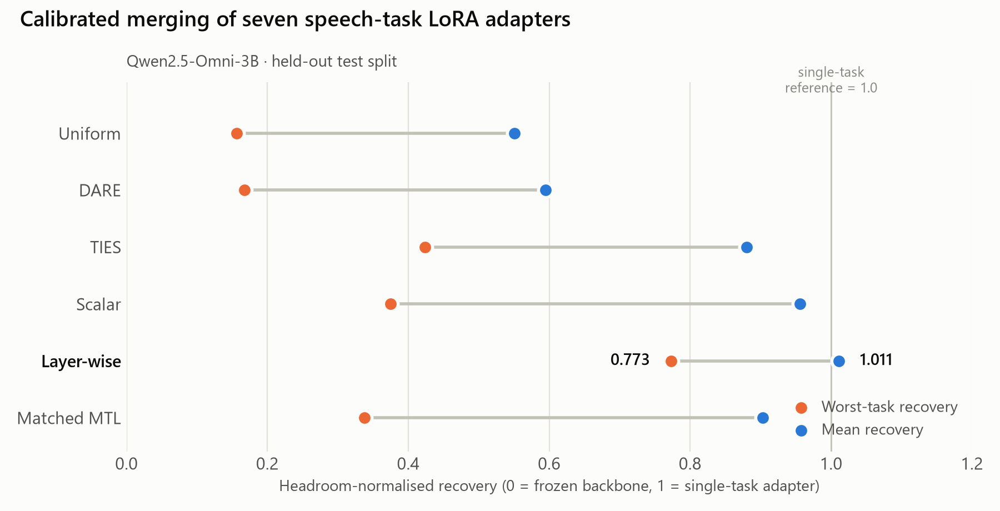
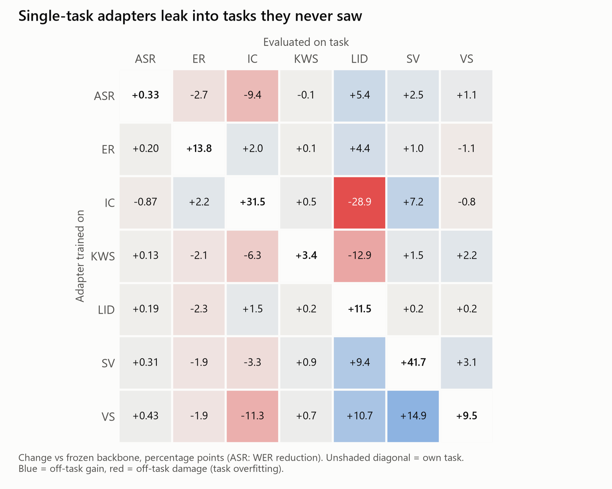
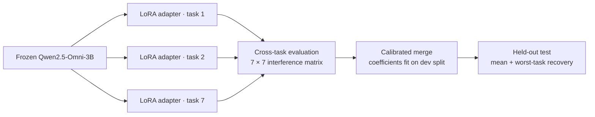

# Model Merging and Task Overfitting in Speech LLMs

Independently trained LoRA adapters for a 3B-parameter Speech LLM quietly break each other's tasks. This project measures that failure, diagnoses it, and fixes it with calibrated post-hoc merging — no joint retraining required.

**[MEng thesis (PDF)](docs/Rajaram_2026_MEng_Thesis_Model_Merging_Speech_LLMs.pdf)** · University of Cambridge, 2026 · supervised by Prof. Phil Woodland and Dr Guangzhi Sun

<p align="center">
  <picture>
    <source media="(prefers-color-scheme: dark)" srcset="assets/recovery-dark.png">
    
  </picture>
</p>

## Overview

A Speech LLM answers every task — transcription, intent, emotion, language ID, speaker verification — through one shared decoder. LoRA lets you train a cheap, separately stored adapter per task, which *looks* modular. It isn't: an adapter can excel on its own task while degrading tasks it never saw. This thesis calls that **task overfitting**, shows that single-task evaluation cannot detect it, and asks whether independently trained adapters can still be combined into one reliable multi-task model by calibrating *how much* each contributes.

Experiments cover **7 speech tasks** (ASR, emotion, intent, keyword spotting, language ID, speaker verification, vocal sounds) on a frozen **Qwen2.5-Omni-3B** backbone, comparing post-hoc merging against a capacity-matched multi-task learning (MTL) baseline and continual task-addition.

## Key results

- **Task overfitting is real, directional and invisible to single-task evaluation.** The intent adapter lifts its own task from 54.0% to 85.5% accuracy — and drops language-ID accuracy from 88.4% to **59.5%**. Task vectors are near-orthogonal (pairwise cosine −0.003 to 0.045), so weight-space geometry doesn't predict which pairs collide.
- **The failure is magnitude, not direction.** Naive averaging recovers only **0.551** of single-task gains. One globally calibrated scalar lifts that to **0.956**; supervised **layer-wise** calibration (296 scalars over fixed task vectors) reaches **1.011 mean** and **0.773 worst-task** recovery — the best of every method tested, including TIES and DARE.
- **Competitive with joint retraining, at a fraction of the data.** Matched MTL wins on non-ASR mean recovery (0.997), but layer-wise merging gives better worst-task balance and lower ASR WER (1.81% vs 2.24% on test-clean; 4.00% vs 5.74% on test-other), while using **16× fewer training examples** (14,400 vs 230,228).
- **Scales to a changing task suite.** In continual task-addition, layer-wise merging is the only method that keeps every retained task above 0.60 recovery across all five task orders.
- **20.7× lower peak GPU memory** for gradient-based merging, by applying weighted LoRA products in a fused forward pass instead of materialising dense deltas (2.1 GiB vs 44.5 GiB, RTX 6000 Ada).

| Method (7-task merge) | Parameters fit to combine tasks | Mean recovery ↑ | Worst-task recovery ↑ | ASR WER ↓ |
| --- | ---: | ---: | ---: | ---: |
| Uniform averaging | 0 | 0.551 | 0.156 | 1.90% |
| DARE | 0 | 0.595 | 0.167 | 1.88% |
| TIES | 0 | 0.880 | 0.424 | 1.81% |
| Scalar (Bayesian-optimised γ) | 1 | 0.956 | 0.375 | **1.72%** |
| **Layer-wise (this work)** | **296** | **1.011** | **0.773** | 1.81% |
| Matched MTL | 164.6M | 0.903 | 0.338 | 2.24% |

<sub>Recovery is headroom-normalised: 0 = frozen backbone, 1 = the task's own single-task adapter. References: backbone 2.35% WER, single-task ASR adapter 2.02% WER (LibriSpeech test-clean). All numbers are held-out test results from the thesis.</sub>

## Where adapters interfere

<p align="center">
  <picture>
    <source media="(prefers-color-scheme: dark)" srcset="assets/interference-dark.png">
    
  </picture>
</p>

Every adapter improves its own task (diagonal), but off-diagonal effects are large and asymmetric: intent and keyword adapters damage language ID through a shifted label prior (the model over-predicts English), while vocal-sound adapters *improve* ASR and LID. Beneficial and harmful effects coexisting in one adapter set is exactly why calibration, rather than simple addition, works.

## Method



1. **Task vectors.** Each task gets one LoRA adapter (rank 64, α = 128, on attention, MLP and audio projector). Its effective update $\Delta W_t = \tfrac{\alpha}{r} B_t A_t$ is a task vector $\tau_t$ relative to the frozen backbone.
2. **Merging.** The merged model is $\theta_0 + \sum_t \lambda_{t} \tau_t$. *Scalar* sets $\lambda_t = \gamma$ by Bayesian optimisation; *Layer-wise* learns $\lambda_{t,\ell} = \beta_\ell w_{\ell,t}$ per layer by gradient descent on development data, with source adapters frozen.
3. **Evaluation.** Recovery $R_i = (m_i^{\text{merge}} - m_i^{\text{base}}) / (m_i^{\text{single}} - m_i^{\text{base}})$, reported as both mean and **worst-task** — because a mean can hide one broken task.
4. **Baselines.** Uniform averaging, TIES, DARE, a capacity-matched joint MTL adapter, and sequential MTL for continual addition.

## Repository structure

```text
main.py          Unified CLI: train, evaluate, mtl, merge, merge-sweep, continual-merge, ...
configs/         YAML configs for tasks, merges (uniform, scalar, TIES, DARE, layer-wise), MTL, continual
core/            Config, data, training, evaluation and results utilities
tasks/           Per-task datasets, prompts, collators and metrics (ASR, ER, IC, KWS, LID, SV, VS, SQA)
merging/         Task-vector sources, merge methods, coefficient optimisers, continual merging
scripts/         Experiment runners, result builders and the plotting code behind the thesis figures
tests/           Unit and integration tests (pytest)
docs/            MEng thesis (PDF)
```

## Reproducing

Requires a CUDA GPU (experiments ran on a 48 GB RTX 6000 Ada) and the Qwen2.5-Omni-3B weights at `data/models/Qwen2.5-Omni-3B`. Most datasets load from Hugging Face; MELD and VocalSound are expected under `data/datasets/`.

```bash
pip install -r requirements.txt

# 1. Train and evaluate a single-task adapter
python main.py train    --task intent --config intent.yaml
python main.py evaluate --task intent --config intent.yaml --split test

# 2. Seven-task layer-wise merge (fit coefficients, then evaluate on test)
python main.py merge-sweep --config configs/merge/supermerge/merge_supermerge_emotion_intent_kws_langid_speaker_ver_asr_vocalsound.yaml
python main.py evaluate-merged \
  --config configs/merge/supermerge/merge_supermerge_emotion_intent_kws_langid_speaker_ver_asr_vocalsound.yaml \
  --eval-tasks emotion intent kws langid speaker_ver asr vocalsound --split test

# 3. Joint-MTL baseline (the task suite is set by `tasks:` in the config)
python main.py mtl --config configs/mtl/joint/mtl_intent_kws_langid_asr_emotion_vocalsound.yaml

# Tests that need no model or data
cd tests && pytest -m "not requires_model and not requires_data and not requires_network"
```

Scalar, TIES and DARE merges use the matching configs in `configs/merge/uniform_scalar_delta/`, `ties/` and `dare/`; continual paths are defined in `configs/continual/`.

## Tech stack

PyTorch · Hugging Face Transformers, PEFT and Datasets · Qwen2.5-Omni-3B · LoRA · Bayesian optimisation · jiwer · Weights & Biases · pytest

## Citation

```bibtex
@mastersthesis{rajaram2026merging,
  author = {Ebinezer Rajaram},
  title  = {Model Merging and Task Overfitting in Speech {LLMs}},
  school = {University of Cambridge},
  type   = {{MEng} thesis},
  year   = {2026}
}
```

A [`CITATION.cff`](CITATION.cff) is included, so GitHub's *Cite this repository* button gives the same entry.

## Acknowledgements

MEng thesis, Department of Engineering, University of Cambridge (2026), supervised by Professor Phil Woodland and Dr Guangzhi Sun.

## Licence

[Apache 2.0](LICENSE.md)
